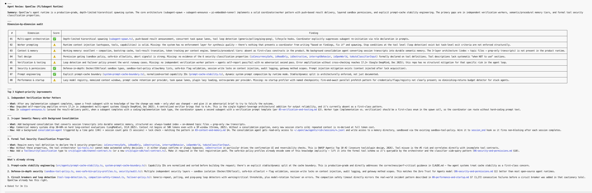

# 9 Things I Learned Reading Claude Code's Source Code

*A deep dive into how Anthropic's production agent actually works — with the real code, the real design decisions, and the research that explains why each decision was made*

---

Most "agent best practices" posts give you generic advice. This one is different.

Claude Code is one of the few production-grade AI coding agents with readable source code. I went through it. What follows are 9 concrete things the Anthropic engineering team did — with the actual TypeScript — matched against the benchmark research that explains *why* each decision matters.

Each section ends with what you should change in your own agent today.

---

## Benchmarks at a Glance

| Claim | Number | Source |
|-------|--------|--------|
| Enterprise agent failure rate (year 1) | 73% | Cleanlab, 2025 |
| Multi-agent error amplification — unstructured | 17.2× | Google DeepMind, Dec 2025 |
| Multi-agent error amplification — centralized | 4.4× | Google DeepMind, Dec 2025 |
| Single-agent wins on sequential tasks | 64% | Princeton NLP, 2025 |
| Scaffold gain, same model | +8 pp (62.3% → 70.3%) | SWE-bench, Feb 2025 |
| Context degradation onset | 50K tokens even with 1M window | Chroma / Morph, 2025 |
| Lost-in-the-middle accuracy drop | ~30%+ | Liu et al. (Stanford), 2024 |
| Agentic RAG vs traditional RAG | +26% accuracy, 90% fewer tokens | Multiple, 2025 |
| Prompt injection in production deployments | 73% vulnerable | OWASP audits, 2025 |
| Defense layers reduce attack success | 73.2% → 8.7% | Layered defense research, 2025 |
| Unguided self-reflection gain (frontier) | +1.8 pp over 5 iterations | 2025 refinement study |
| Guided external feedback gain | +80% within 5 turns | 2025 refinement study |
| Token usage explains performance variance | 80% | Google Research, BrowseComp 2025 |
| System prompt cacheable fraction | 70–90% | Anthropic prompt caching, 2025 |
| 20-step agent at 95% per-step reliability | 36% end-to-end success | Compounding math |

---

## 1. CLAUDE.md Is Not in the System Prompt

This is the most counterintuitive thing in Claude Code's architecture, and the one most teams building similar tools get wrong.

Every Claude Code user knows about `CLAUDE.md` — the file where you put project-specific instructions. The natural assumption is that it gets injected into the system prompt. **It does not.** It goes into the user turn.

```typescript
// src/context.ts
export const getUserContext = memoize(
  async (): Promise<{ [k: string]: string }> => {
    const claudeMd = shouldDisableClaudeMd
      ? null
      : getClaudeMds(filterInjectedMemoryFiles(await getMemoryFiles()))

    return {
      ...(claudeMd && { claudeMd }),
      currentDate: `Today's date is ${getLocalISODate()}.`,
    }
  },
)
```

And here's where it gets injected:

```typescript
// src/utils/api.ts
export function prependUserContext(
  messages: Message[],
  context: { [k: string]: string },
): Message[] {
  return [
    createUserMessage({
      content: `<system-reminder>\nAs you answer the user's questions, you can use the following context:\n${Object.entries(
        context,
      )
        .map(([key, value]) => `# ${key}\n${value}`)
        .join('\n')}

      IMPORTANT: this context may or may not be relevant to your tasks. You should not respond to this context unless it is highly relevant to your task.\n</system-reminder>\n`,
      isMeta: true,
    }),
    ...messages,
  ]
}
```

`getUserContext()` returns `claudeMd` and `currentDate`. Both are wrapped in a `<system-reminder>` block inside a **user message** — `isMeta: true` marks it as infrastructure, invisible to the user — and prepended to the conversation. Contrast this with `getSystemContext()`, which returns `gitStatus` and is appended to the actual system prompt via `appendSystemContext()`.

**Why this is the right call — and the research behind it:**

Chroma's 2025 study measured 18 frontier LLMs and found a universal result: context degradation begins at **50K tokens even in models with 1M-token windows**, and information in the middle of context is recalled with ~30% lower accuracy than content at the start or end (Liu et al., Stanford 2024). The system prompt is where the model's core identity and instructions live — it needs to be compact, stable, and reliably attended to.

CLAUDE.md is project-specific. If it were in the system prompt, two things would go wrong: every project change would bust the prompt cache (70–90% of the system prompt is otherwise stably cacheable), and project context would compete with core instructions for the model's attention budget. By moving it to the first user turn, the system prompt stays stable and cacheable at org scope, and CLAUDE.md is treated as contextual information the model reads — not as part of its identity.

**What to change today:** If your agent's project-specific context is in the system prompt, move it to the first user turn wrapped in a `<system-reminder>` block. Keep your system prompt stable. Let project context be contextual.

---

## 2. Cache Boundaries Are Named and Enforced in Code

Token usage explains **80% of BrowseComp performance variance** (Google Research, 2025). The ceiling on your agent's performance is often not the model — it's how efficiently you're spending the token budget you have. Cache misses are the biggest unforced error in production agents.

Claude Code handles this by making cache boundary violations visible at the code level. Two functions, explicitly named to signal cost:

```typescript
// src/constants/systemPromptSections.ts

/**
 * Create a memoized system prompt section.
 * Computed once, cached until /clear or /compact.
 */
export function systemPromptSection(
  name: string,
  compute: ComputeFn,
): SystemPromptSection {
  return { name, compute, cacheBreak: false }
}

/**
 * Create a volatile system prompt section that recomputes every turn.
 * This WILL break the prompt cache when the value changes.
 * Requires a reason explaining why cache-breaking is necessary.
 */
export function DANGEROUS_uncachedSystemPromptSection(
  name: string,
  compute: ComputeFn,
  _reason: string,  // ← you must write why
): SystemPromptSection {
  return { name, compute, cacheBreak: true }
}
```

`DANGEROUS_uncachedSystemPromptSection` takes a `_reason` parameter. The underscore means it's not used at runtime — it's documentation-as-code. Every engineer who calls this function has to write a reason why this section should recompute every turn and break the cache. The naming makes the cost visible in code review.

The system prompt has a literal boundary marker between globally-cacheable and dynamic content:

```typescript
// src/constants/prompts.ts
export const SYSTEM_PROMPT_DYNAMIC_BOUNDARY =
  '__SYSTEM_PROMPT_DYNAMIC_BOUNDARY__'
```

Feature flags follow the same explicit-cost convention:

```typescript
// src/coordinator/coordinatorMode.ts
checkStatsigFeatureGate_CACHED_MAY_BE_STALE('tengu_scratch')
```

`_CACHED_MAY_BE_STALE` is the name — not a comment. When you call this function you are declaring you accept a stale value. The alternative (`initializeFeatureFlags()`) makes a network call. Every call site makes the tradeoff explicit.

**What to change today:** Name your volatile prompt sections explicitly. Use `VOLATILE_` or `UNCACHED_` as a prefix for anything that recomputes each turn. If 70–90% of your system prompt is stable, treat that stability as an asset worth protecting.

---

## 3. The Verification Agent Cannot Edit Files — By Design

73% of enterprise AI agents fail in their first year (Cleanlab, 2025). The most common reason isn't model capability — it's that self-reported success isn't verified. Claude Code ships a built-in verification agent that addresses this architecturally:

```typescript
// src/tools/AgentTool/built-in/verificationAgent.ts

export const VERIFICATION_AGENT: BuiltInAgentDefinition = {
  agentType: 'verification',
  disallowedTools: [
    AGENT_TOOL_NAME,
    EXIT_PLAN_MODE_TOOL_NAME,
    FILE_EDIT_TOOL_NAME,    // cannot edit files
    FILE_WRITE_TOOL_NAME,   // cannot write files
    NOTEBOOK_EDIT_TOOL_NAME,
  ],
  source: 'built-in',
  background: true,
  model: 'inherit',
  getSystemPrompt: () => VERIFICATION_SYSTEM_PROMPT,
  criticalSystemReminder_EXPERIMENTAL:
    'CRITICAL: This is a VERIFICATION-ONLY task. You CANNOT edit, write, or create files IN THE PROJECT DIRECTORY. You MUST end with VERDICT: PASS, VERDICT: FAIL, or VERDICT: PARTIAL.',
}
```

`FILE_EDIT_TOOL_NAME` and `FILE_WRITE_TOOL_NAME` are in `disallowedTools`. This is not a prompt instruction — it's an architectural constraint. The agent literally cannot edit files. Not because it was told not to, but because the tool isn't in its available set.

**Why the separation matters:** A 2025 refinement study (1,000 problems, 11 domains) found that unguided self-reflection at the frontier adds just **+1.8 pp** over 5 iterations. The same model given guided external feedback with structured mechanisms gained **+80% within 5 turns**. The difference is not model capability — it's structure. A separate verification agent with its own tool constraints, its own system prompt, and a required verdict format is structured external feedback. Asking your implementation agent to "verify its own work" is unguided self-reflection.

The `criticalSystemReminder_EXPERIMENTAL` field is also revealing — it's a separate injection mechanism that provides a persistent reminder at a location designed to survive context rot, independent of the main system prompt. Even a good system prompt can be "forgotten" as context grows. The critical reminder is a second anchor.

**What to change today:** Separate your verification agent architecturally. Use `disallowedTools` at the framework level, not just a prompt instruction. A verification agent that can edit files is not a verification agent — it's just another implementation agent with a different name.

---

## 4. The Denial Circuit Breaker Is Exact and Enforced

OWASP's 2025 audit found prompt injection in **73% of production agentic deployments**. Standard injection success rates run 50–84%. The most capable adaptive attacks succeed over 85% of the time against undefended systems. Yet only 34.7% of organizations have dedicated injection defenses.

Claude Code's permission system includes a circuit breaker with specific, hardcoded thresholds from production incident data:

```typescript
// src/utils/permissions/denialTracking.ts

export const DENIAL_LIMITS = {
  maxConsecutive: 3,
  maxTotal: 20,
} as const

export function shouldFallbackToPrompting(
  state: DenialTrackingState,
): boolean {
  return (
    state.consecutiveDenials >= DENIAL_LIMITS.maxConsecutive ||
    state.totalDenials >= DENIAL_LIMITS.maxTotal
  )
}
```

3 consecutive denials, or 20 total: fall back to prompting the user. Two distinct failure modes:

1. **Consecutive** (3 max): stuck in a loop on the same blocked action — injection or runaway behavior
2. **Total** (20 max): operating broadly outside permitted scope — misconfiguration or session drift

State is tracked immutably. A success resets the consecutive counter but not the total:

```typescript
export function recordDenial(state: DenialTrackingState): DenialTrackingState {
  return {
    ...state,
    consecutiveDenials: state.consecutiveDenials + 1,
    totalDenials: state.totalDenials + 1,
  }
}

export function recordSuccess(state: DenialTrackingState): DenialTrackingState {
  if (state.consecutiveDenials === 0) return state
  return { ...state, consecutiveDenials: 0 }
}
```

The immutable update pattern is intentional — denial state cannot be mutated in place, which prevents a compromised tool from silently resetting its own counter. For async subagents whose `setAppState` is a no-op, a `localDenialTracking` field is passed through the agent context so the counter accumulates correctly even when the agent can't reach the main state store.

Layered defense reduces injection attack success from **73.2% → 8.7%** (layered defense research, 2025). The denial circuit breaker is one layer. The immutability of state is another.

**What to change today:** Add a denial circuit breaker. Track consecutive and total separately. When either threshold triggers, surface to the user — do not retry. Those exact numbers (3, 20) came from production incidents; they're a reasonable starting point.

---

## 5. Tools Default to Unsafe

40% of agent frameworks have exploitable tool-execution flaws (OWASP / security research, 2025). Most of these aren't in the tool logic — they're in the defaults. A tool that doesn't declare its access scope, mutability, or concurrency behavior gets assumed into a posture by the framework.

Claude Code's posture is fail-closed:

```typescript
// src/Tool.ts

const TOOL_DEFAULTS = {
  isEnabled: () => true,
  isConcurrencySafe: (_input?) => false,   // assume NOT safe
  isReadOnly: (_input?) => false,           // assume WRITES
  isDestructive: (_input?) => false,
  checkPermissions: (input, _ctx?): Promise<PermissionResult> =>
    Promise.resolve({ behavior: 'allow', updatedInput: input }),
  toAutoClassifierInput: (_input?) => '',   // skip security classifier
  userFacingName: (_input?) => '',
}

export function buildTool<D extends AnyToolDef>(def: D): BuiltTool<D> {
  return {
    ...TOOL_DEFAULTS,
    userFacingName: () => def.name,
    ...def,
  } as BuiltTool<D>
}
```

- `isConcurrencySafe: false` — assume cannot run in parallel
- `isReadOnly: false` — assume writes
- `toAutoClassifierInput: () => ''` — invisible to the security classifier

A new tool that doesn't declare itself read-only is treated as a writer. A new tool that doesn't declare concurrency safety is serialized. A new tool without a classifier representation is invisible to auto-mode security analysis — which is safer than a wrong representation.

The OWASP Top 10 for Agentic Applications (2026) lists "insecure tool/plugin design" as #2. The tool interface also enforces `interruptBehavior`:

```typescript
/**
 * - 'cancel' — stop the tool and discard its result
 * - 'block'  — keep running; the new message waits
 * Defaults to 'block' when not implemented.
 */
interruptBehavior?(): 'cancel' | 'block'
```

A read-only search tool should `cancel` when interrupted — no point finishing a search the user has moved past. A write operation should `block` — abandoning a half-written edit is worse than making the user wait.

**What to change today:** Explicitly declare `isReadOnly`, `isConcurrencySafe`, and `isDestructive` on every tool. Fail-closed defaults prevent the silent privilege creep that causes 40% of framework-level exploits.

---

## 6. Agents Are Typed and Lifecycle-Managed

A 20-step agent at 95% per-step reliability has only a **36% chance of end-to-end success** — pure compounding. Every premature termination, failed cleanup, or undetected hung agent eats directly into that already-thin margin.

Claude Code's task system distinguishes seven agent types and five lifecycle states:

```typescript
// src/Task.ts

export type TaskType =
  | 'local_bash'
  | 'local_agent'
  | 'remote_agent'
  | 'in_process_teammate'
  | 'local_workflow'
  | 'monitor_mcp'
  | 'dream'

export type TaskStatus =
  | 'pending'
  | 'running'
  | 'completed'
  | 'failed'
  | 'killed'

export function isTerminalTaskStatus(status: TaskStatus): boolean {
  return status === 'completed' || status === 'failed' || status === 'killed'
}
```

`'killed'` is distinct from `'failed'`. A failed task encountered an error; a killed task was deliberately stopped. This matters for retry logic — a killed task should not be retried, a failed task might be. `isTerminalTaskStatus` is the single source of truth for "will this task transition again?" — all cleanup logic gates on this one function.

Task IDs are typed by agent type with a security-conscious alphabet:

```typescript
// 36^8 ≈ 2.8 trillion combinations, sufficient to resist brute-force symlink attacks.
const TASK_ID_ALPHABET = '0123456789abcdefghijklmnopqrstuvwxyz'

const TASK_ID_PREFIXES: Record<string, string> = {
  local_bash:          'b',
  local_agent:         'a',
  remote_agent:        'r',
  in_process_teammate: 't',
  local_workflow:      'w',
  monitor_mcp:         'm',
  dream:               'd',
}
```

The prefix makes the agent type instantly readable from any task ID in logs. The design comment — "resist brute-force symlink attacks" — shows someone thought about what an attacker could do with predictable IDs. `'dream'` is an internal designation for speculative agent modes that explore possibilities without committing.

**What to change today:** Add explicit lifecycle states. Distinguish killed from failed. Gate all cleanup logic on a single `isTerminalStatus()` function. The 36% end-to-end success ceiling gets worse fast when your cleanup paths are inconsistent.

---

## 7. The Verification Agent's System Prompt Is the Product

Scaffold design — not model capability — accounts for **+8 percentage points on SWE-bench** (62.3% → 70.3%, same model, SWE-bench Feb 2025). That's more than many model upgrades deliver. The verification agent's system prompt is where most of that gain lives.

The structure is worth studying as a template:

**1. Named failure modes first.** The prompt opens by naming the two ways the verification agent fails:

> "You have two documented failure patterns. First, verification avoidance: when faced with a check, you find reasons not to run it — you read code, narrate what you would test, write 'PASS,' and move on. Second, being seduced by the first 80%: you see a polished UI or a passing test suite and feel inclined to pass it, not noticing half the buttons do nothing..."

**2. Hard prohibitions in ALL CAPS.** `=== CRITICAL: DO NOT MODIFY THE PROJECT ===`. Frontier models respond to visual prominence. Important prohibitions get headers.

**3. Type-specific strategies.** The prompt provides distinct verification paths for frontend, backend/API, CLI, infrastructure, library, bug fix, mobile, data/ML, migrations, and refactoring. One-size-fits-all verification is how agents confirm the happy path and call it done.

**4. Required output format.** Every check: `Command run` → `Output observed` → `Result`. A PASS without a command is a skip. The caller can spot-check by re-running the command.

**5. Pre-emptive rationalization blocking:**

> "- 'The code looks correct based on my reading' — reading is not verification. Run it.
> - 'The implementer's tests already pass' — the implementer is an LLM. Verify independently.
> - 'This is probably fine' — probably is not verified. Run it."

**6. Mandatory adversarial probe.** Before PASS, the agent must run at least one concurrency, boundary, idempotency, or orphan-operation probe. This is the guard against confirming the happy path.

```typescript
const VERIFICATION_WHEN_TO_USE =
  'Invoke after non-trivial tasks (3+ file edits, backend/API changes, infrastructure changes).'
```

The "3+ file edits" threshold is the point at which self-verification becomes unreliable enough to warrant an independent agent. Below that, the self-reporting risk is acceptable. Above it, the +80% gain from structured external feedback over +1.8pp unguided self-reflection justifies the overhead.

**What to change today:** Write your verification agent's system prompt around its failure modes, not its goals. Require evidence, not narration. Require a parseable verdict. Pre-write the rationalizations it will reach for — then block them.

---

## 8. Swarm Initialization Distinguishes Resumed From Fresh

Multi-agent systems reduce error amplification from 17.2× (unstructured) to **4.4× with centralized orchestration** (Google DeepMind, Dec 2025) — but only when the agents correctly reconstruct their state on startup. A resumed agent that re-initializes as a fresh agent loses its team identity, its permission hooks, and its place in the workflow.

Claude Code's swarm initialization explicitly handles both paths:

```typescript
// src/hooks/useSwarmInitialization.ts

export function useSwarmInitialization(
  setAppState: SetAppState,
  initialMessages: Message[] | undefined,
): void {
  useEffect(() => {
    if (isAgentSwarmsEnabled()) {
      const firstMessage = initialMessages?.[0]
      const teamName = firstMessage?.teamName
      const agentName = firstMessage?.agentName

      if (teamName && agentName) {
        // RESUMED — identity stored in transcript
        initializeTeammateContextFromSession(setAppState, teamName, agentName)
        const teamFile = readTeamFile(teamName)
        const member = teamFile?.members.find(m => m.name === agentName)
        if (member) {
          initializeTeammateHooks(setAppState, getSessionId(), {
            teamName, agentId: member.agentId, agentName,
          })
        }
      } else {
        // FRESH spawn — identity from environment
        const context = getDynamicTeamContext?.()
        if (context?.teamName && context?.agentId && context?.agentName) {
          initializeTeammateHooks(setAppState, getSessionId(), context)
        }
      }
    }
  }, [setAppState, initialMessages])
}
```

A resumed agent reads `teamName` and `agentName` from `firstMessage` — the transcript is the source of truth. A fresh agent reads from the environment. Team membership is stored in a `teamFile` on disk; each member has an `agentId` that survives resume. The permission hooks are initialized from this persisted state.

**Why this distinction matters at scale:** Princeton NLP's 2025 study found single agents win **64% of sequential tasks** — multi-agent coordination only pays on parallelizable work. Gains plateau above 4 concurrent agents. Coordination overhead for resumed sessions that incorrectly re-initialize as fresh agents is exactly the kind of waste that drives teams below that threshold.

**What to change today:** Explicitly handle the fresh vs resumed startup case for every stateful agent. Store agent identity in the transcript, not just the environment. On resume, reconstruct from transcript state. A resumed agent that re-initializes fresh is indistinguishable from a new agent — it loses everything that makes coordination work.

---

## 9. The Buffer Gate for Message Ordering

Single-agent latency is 2–4 seconds per task; multi-agent is 8–15 seconds (multi-agent framework benchmarks, 2025). Interleaved messages during session flush are one of the fastest ways to turn a 2-second response into a broken one that requires a full restart.

When a Claude Code session starts, it flushes historical messages to the server in a single HTTP POST. New messages that arrive during this flush must be queued — not sent — or they interleave with the historical batch and produce a broken conversation state.

```typescript
// src/bridge/flushGate.ts

export class FlushGate<T> {
  private _active = false
  private _pending: T[] = []

  start(): void { this._active = true }

  end(): T[] {
    this._active = false
    return this._pending.splice(0)   // atomic: drain and clear in one operation
  }

  enqueue(...items: T[]): boolean {
    if (!this._active) return false
    this._pending.push(...items)
    return true
  }

  drop(): number {
    this._active = false
    const count = this._pending.length
    this._pending.length = 0
    return count
  }

  deactivate(): void {
    this._active = false
    // Does NOT drop items — new transport will drain them
  }
}
```

`deactivate()` clears the active flag without dropping items — for transport replacement. `drop()` discards everything — for permanent close. `end()` uses `splice(0)`, not `this._pending` then `this._pending = []`, because `splice(0)` is atomic: returns all items and empties the array in a single operation with no window for new items to slip in.

For capacity management, the poll loop uses two intervals:

```typescript
// src/bridge/pollConfigDefaults.ts

const POLL_INTERVAL_MS_NOT_AT_CAPACITY = 2000     // actively seeking work
const POLL_INTERVAL_MS_AT_CAPACITY = 600_000       // 10 minutes — liveness only
```

Not-at-capacity: poll every 2 seconds. At-capacity: poll every 10 minutes — not to pick up work (the WebSocket transport handles that), but as a liveness signal to keep the Redis key alive (TTL = 4 hours; 10-minute poll gives 24× headroom).

**What to change today:** If your agent handles streaming messages or session bridging, implement a flush gate before you need it. The bugs from interleaved messages are hard to reproduce and hard to debug. The gate takes 30 minutes to add proactively and days to diagnose after the fact.

---

## What These 9 Patterns Have in Common

**1. Architecture enforces constraints that prompts cannot.** The verification agent can't edit files because the tool isn't available. Denial limits are hardcoded constants, not configurable at runtime. Permission defaults are fail-closed. Instructions drift; architecture holds.

**2. Naming makes costs visible.** `DANGEROUS_uncachedSystemPromptSection`, `checkStatsigFeatureGate_CACHED_MAY_BE_STALE`, `_reason` as a required-but-unused parameter. The naming convention is the documentation. Cache-breaking decisions can't be made accidentally.

**3. Failure modes are written down.** The verification agent's system prompt names its own two failure patterns. The denial circuit breaker has exact thresholds from production incidents. The flush gate has a `deactivate()` path specifically for transport replacement. These aren't defensive programming — they're the result of things going wrong in production, being understood, and being fixed precisely.

**4. Fresh and resumed are always distinguished.** Every stateful component handles both startup paths. This is the difference between a system that works in demos (always fresh) and one that works in production (frequently resumed).

**5. Context placement is intentional.** CLAUDE.md in the user turn, git status in the system prompt, critical reminders in a separate injection field. The middle of context is where information goes to be forgotten — ~30% accuracy drop (Liu et al., Stanford 2024). Every piece of information has a deliberate placement relative to that constraint.

The 73% first-year failure rate isn't a model problem. The models are good enough. These patterns are what separates agents that work in production from agents that work in demos.

---

## Seeing It In Practice: A Real Review of OpenClaw

To make this concrete, here's what `/review-agent` produced when run against [OpenClaw](https://github.com/openclaw), a production-grade open-source Pi/subagent runtime. The command explored the repo automatically — no code was pasted.



A few things worth noting from this output:

**What scored well:** OpenClaw had two ✅ dimensions — orchestration and security — which are the hardest to retrofit. The prompt-cache stability engineering (`prompt-cache-stability.ts`, `system-prompt-cache-boundary.ts`) is exactly the pattern from section 2 of this post: capability IDs normalized and sorted, explicit stable/dynamic boundary enforced in code. The defense-in-depth security stack (sandbox isolation, safe-bin allowlists, session write locks, audit logging) maps directly to the Zero Trust model in the best practices.

**Where the gaps were:** Four ⚠️ dimensions. The most critical: no independent verification worker. Agents self-report pass/fail with no adversarial second pass — which is the unguided self-reflection problem (+1.8 pp vs +80% with structured external feedback). The second gap: working memory is excellent but semantic/procedural memory tiers don't exist as first-class constructs. Every session starts cold.

**The top improvement:** Spawn a fresh verification subagent after every implementation task. Give it only *what* changed, not *how* — and an adversarial brief. One architectural change, 17.2× → 4.4× error amplification.

The full review with implementation sketches for all three improvements is in [`openclaw-review-results.md`](./openclaw-review-results.md) in this repo.

---

## The Reference Library

All 9 best-practice docs with benchmark tables and primary source citations are open source, along with skills for Claude Code, Cursor, Codex CLI, Gemini CLI, Windsurf, Aider, and Continue.dev:

**[github.com/sarkar-ai-taken/agent-loop-learning](https://github.com/sarkar-ai-taken/agent-loop-learning)**

```
/review-agent    → full audit against 9 dimensions with ✅/⚠️/❌ scorecard
/improve-agent   → improvement cards for a specific component
/best-practices  → load a reference doc by topic keyword
```

---

*All code excerpts are from the Claude Code source (April 2026 codebase). All benchmark numbers include primary source citations in the reference library above.*
